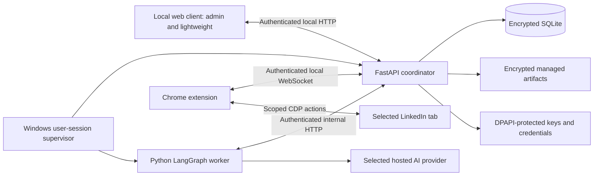

# LILA Claw — Local Intelligent LinkedIn Assistant

Your intelligent assistant for LinkedIn. LILA Claw is a free, open-source tool that runs entirely on your own computer, using your own LinkedIn account. It finds jobs relevant to your profile and search criteria, fills in application questions, tailors resumes to each job, and applies -- with truthful information, explicit control, and accountable outcomes.

## Contents

- [Project Status](#project-status)
- [Features](#features)
- [Architecture](#architecture)
- [Tech Stack](#tech-stack)
- [Getting Started](#getting-started)
- [Tests](#tests)
- [Documentation](#documentation)
- [Project Roadmap](#project-roadmap)
- [Contributing](#contributing)
- [Disclaimer](#disclaimer)
- [Terms and Conditions](#terms-and-conditions)
- [License](#license)
- [Socials](#socials)

## Project Status

LILA Claw is under active development, delivered through milestone-based increments (M0-M8). The specification is complete and approved across five stages: Business Requirements, Solution Design, Functional Requirements, High-Level Design, and Low-Level Design.

| Milestone | Scope | Status |
|-----------|-------|--------|
| M0 | Foundation: source layout, dependency locks, contracts, fixtures | Verified (27 tests) |
| M1 | Trust/runtime: supervisor, TLS, DPAPI, SQLCipher, pairing, sessions | Verified (19 tests) |
| M2 | Domain/controls: task lifecycle, facts, authority, identity, ledger | Verified (53 tests) |
| M3 | Worker/AI: LangGraph orchestration, provider budget, grounded drafting | In progress |
| M4 | Browser: chrome extension, CDP tools, capability reporting | In progress |
| M5 | Full UX: client screens, setup/task/review workflows | Planned |
| M6 | Privacy/recovery: snapshots, export, restore, audit retention | Planned |
| M7 | Distribution: installer, signatures, updates | Planned |
| M8 | Acceptance: regression, UAT, release | Planned |

Planned, not promised: no active milestone will be marked complete before its verified exit gate is met. Real LinkedIn actions are deferred until the authorized browser qualification and user acceptance complete. See the [implementation plan](docs/implementation-plan.md) and [implementation evidence](docs/implementation-evidence/) for the current execution record.

## Features

- **Autonomous job application** -- discovers matching jobs, fills supported application questions, and submits within configured authority limits.
- **Verified facts** -- answers are grounded in versioned, truth-checked facts. No fabricated answers are generated.
- **Tailored resumes** -- each resume is customized to the job description, required skills, and company context.
- **Privacy-first and local** -- everything runs on your machine. Data is stored in encrypted (SQLCipher) databases under Windows DPAPI protection, served over TLS on loopback only.
- **Accountable by design** -- every outward action has a durable action ledger entry, an explicit authorization reference, and an outcome status.
- **Recovery built in** -- checkpoint-based workers resume interrupted tasks without duplicate external effects.
- **Two client modes** -- an admin mode for full configuration and a lightweight mode for daily instructions, approvals, and results.
- **Control from the browser** -- a compact Chrome extension provides status, review prompts, pause, and stop.

## Architecture

LILA Claw runs as three cooperating processes plus a browser extension.



- **Coordinator** (FastAPI) -- sole writer of business state. Owns the encrypted databases, validates commands, enforces authority policies, persists intents before any external action, dispatches browser actions, and reconciles outcomes.
- **Worker** (LangGraph) -- plans and advances tasks, matching jobs to criteria and drafting grounded content. It proposes actions and state; it never touches the browser directly or the database.
- **Supervisor** -- manages process startup, health checks, and bounded recovery. It holds no browser-action authority.
- **Extension** -- executes controlled CDP tools on the selected LinkedIn tab, reports capability, and provides compact controls. It never holds provider credentials and offers no arbitrary script execution.

Trust is enforced at each boundary: client, worker, and extension are authenticated independently with distinct scopes; browser content and model output are treated as untrusted data.

## Tech Stack

| Layer | Technology |
|-------|-----------|
| Backend | Python 3.12, FastAPI |
| AI orchestration | LangGraph |
| Client | React 19, TypeScript, Vite 7 |
| Extension | TypeScript, Chrome APIs |
| Storage | SQLCipher (encrypted SQLite), versioned migrations |
| Security | TLS (local CA), Windows DPAPI, HMAC/Ed25519 session proofs |
| API contracts | JSON Schema, generated Pydantic/TypeScript models |

## Getting Started

### Prerequisites

- Python 3.12 (Windows x64)
- Node.js 22 LTS (for building the web client)
- Google Chrome (for browser execution)

### Installation

```powershell
# Clone the repository, then create the Python environment
python -m venv .venv
.venv\Scripts\pip install -r requirements.lock

# Install Node dependencies and build the web client
npm install
npm run build
```

### Verification

```powershell
# Run the Python test suite (foundation, trust, domain)
.venv\Scripts\python -m pytest

# Type-check and build the web client
npm run typecheck
npm run build
```

### Launch

```powershell
.venv\Scripts\python -m lila.runtime.launcher --help
```

The launcher exposes `setup`, `run`, `open`, `status`, and `quit` operations. The same operations are available via `scripts/run-lila.ps1`.

Note: browser execution and live AI provider calls are gated behind authorized qualification (milestones M3/M4). Until then the system runs against double/fixture providers and browsers.

## Tests

Over 100 automated tests are organized by milestone:

| Suite | Location | Covers |
|-------|----------|--------|
| Foundation | `tests/foundation` | contracts, migrations, imports, schema validation |
| Trust | `tests/trust` | supervisor, TLS, pairing, sessions, storage |
| Domain | `tests/domain` | task lifecycle, facts, authority, ledger, grounding, worker graph |
| Extension | `tests/extension` | capability reporting, connection, session proof |

## Documentation

| Document | Description |
|----------|-------------|
| [Business Requirements (BRD)](docs/BRD-linkedin-intelligent-suite.md) | Approved v1.1; 25 business requirements |
| [Solution Design](docs/solution-design.md) | Approved v0.31; 30 architecture decision records |
| [Functional Requirements (FRD)](docs/FRD-LILA-Claw.md) | Approved v0.3; required behavior and acceptance |
| [High-Level Design (HLD)](docs/HLD-LILA-Claw.md) | Approved v0.1; components and trust boundaries |
| [Low-Level Design (LLD)](docs/lld/) | Approved v0.2; contracts, schemas, detailed tests |
| [Implementation Plan](docs/implementation-plan.md) | M0-M8 milestone plan and work items |
| [Design Decisions](docs/design-decisions/) | 30 ADRs |
| [Implementation Evidence](docs/implementation-evidence/) | Per-milestone verification results |

## Project Roadmap

| Phase | Scope | Status |
|-------|-------|--------|
| Phase 1 | Local client, extension, reliable execution foundation, complete job-search/application journey | Active (M0-M8) |
| Phase 2 | Telegram pairing, remote instructions and approvals | Not started |
| Phase 3 | Scheduled/cron workflows with timezone rules | Not started |
| Phase 4 | Additional channels and advanced recurring workflows | Not started |

Later BRS remains staged: networking, content, engagement, company workflows, and expanded form coverage are retained in the approved scope.

## Contributing

All contributions are welcome. See [CONTRIBUTING.md](CONTRIBUTING.md) for the contribution checklist, code guidelines, attestation requirements, and pull-request workflow. Contributor consent records are maintained in [docs/contributor-consent/contributors.md](docs/contributor-consent/contributors.md).

## Disclaimer

This tool runs on your own computer and acts through your own accounts. It is provided free and open source, with no warranty of any kind. You are responsible for how you use it, including making sure your use complies with the terms of any website or service you use it with. The authors and contributors accept no liability for how it is used.

## Terms and Conditions

Please consider the following:

- **LinkedIn Policies**: LinkedIn has policies regarding automated activity on its platform. It is your responsibility to review and comply with them before using this tool with your account.

- **No Warranties or Guarantees**: This program is provided as-is, without any warranties or guarantees of any kind. The accuracy, reliability, and effectiveness of the program cannot be guaranteed. Use it at your own risk.

- **Disclaimer of Liability**: The creators and contributors of this program shall not be held responsible or liable for any damages or consequences arising from the direct or indirect use, interaction, or actions performed with this program.

- **Use at Your Own Risk**: It is important to exercise caution and ensure that your usage, interactions, and actions with this program comply with applicable laws, regulations, and the terms of the services you use it with.

## License

Copyright (c) 2026 CharanTheAiGuy <suryacharandiv143@gmail.com>

This project is licensed under the **MIT License**. You are free to use, copy, modify, and distribute it -- including in commercial and closed-source work -- as long as the copyright notice and permission notice are preserved. It is provided "as is", without warranty of any kind.

Releases before August 2026 were licensed under the AGPL-3.0. See [`NOTICE`](NOTICE) for the relicensing history, and the [`LICENSE`](LICENSE) file for the full MIT text.

## Socials

- **LinkedIn**: https://www.linkedin.com/in/chandraai/
- **Email**: suryacharandiv143@gmail.com
- **X/Twitter**: 
- **Discord**: 

---

[back to the top](#lila-claw--local-intelligent-linkedin-assistant)