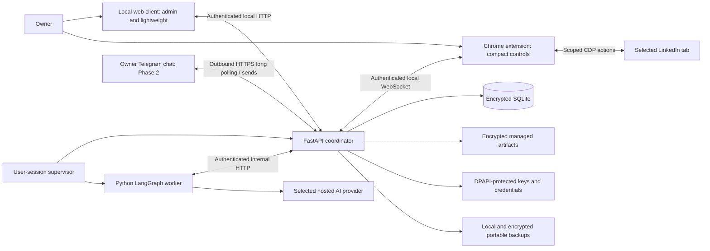

# LILA Claw — High-Level Design

Document ID: HLD-LILA-001  
Version: 0.1  
Status: Approved — see approval record  
Date: 7 September 2026  
Baselines: BRD v1.1; SD v0.31; FRD v0.3 and FD package v0.1

## Purpose and scope

Sponsor approved this HLD; see the [approval record and preserved review version](approval-records/HLD-v0.1-approval.md). Proposal wording below describes the reviewed baseline. LLD preparation is now authorized; implementation evidence and dependency qualification remain outstanding.

Define component responsibilities, interfaces, data ownership, trust boundaries, execution/recovery flows, deployment and validation for the approved Phase 1 functional baseline. This is a proposed HLD, not implementation evidence. Preserve all approved defaults and phase boundaries; do not infer operating permissions from architecture approval.

The design implements a local single-owner Windows 11 x64 product with admin/lightweight web-client modes and a Chrome extension. Telegram enters in Phase 2; scheduling in Phase 3. Later modules reuse the same coordinator authority and require the approved later-phase FRD addenda.

## System context and deployment

Bundle Python, coordinator, worker, supervisor and compiled TypeScript assets. No installed Node.js developer runtime is needed. Chrome installs/updates its extension separately. Local endpoints bind to loopback only; no public backend listener or inbound Telegram webhook is introduced. The supervisor runs under the configured Windows user, with explicit optional login startup. It is not a Windows service and does not log the user into Windows.

Proposed UI live status uses an authenticated same-origin event stream with cursor-based resynchronization plus ordinary HTTP commands. If streaming is unavailable, bounded polling obtains authoritative snapshots. Worker task acquisition uses authenticated internal HTTP long polling. These are HLD proposals within the approved HTTP boundaries, not new external services.

## Component decomposition

| Component | Responsibility | Boundary |
|---|---|---|
| Launcher/supervisor | Singleton startup, health checks, bounded restart, intentional Quit, versioned activation | No browser-action authority; crash restart must respect persisted holds |
| Main client | Setup, task creation, review, controls, facts/documents, analytics and administration | Presents coordinator state; hiding controls is not authorization |
| Coordinator command service | Authenticate commands, validate versions, persist state and return receipt | Sole business-state writer; no direct UI/worker database writes |
| Policy/validation service within coordinator | Scope, expiry, counters, fact readiness, action versions and dispatch eligibility | Deterministic gate; model proposals never grant authority |
| Task/dispatch service within coordinator | Queues, execution ownership, action ledger, extension dispatch and outcome reconciliation | Sole dispatcher; persist intent before external action |
| Worker | LangGraph reasoning, matching explanations, grounded drafts and planning | Proposes actions/state; no direct browser channel, DB access or permission changes |
| Checkpoint adapter | Worker-facing LangGraph persistence through internal API | Checkpoints are orchestration state, not evidence an external action succeeded |
| Extension | Pairing credential, selected-tab context, bounded CDP tools, outcome evidence and compact controls | No provider credentials; no arbitrary worker-supplied scripts/CDP escape hatch |
| Data/artifact services within coordinator | Versioned facts/documents, integrity, staged file readiness, queries | One authority for published artifact metadata and cleanup |
| Audit/analytics services within coordinator | Minimal event journal, corrections, integrity checks and derived reporting | Analytics are projections, not an independent outcome authority |
| Backup/privacy services within coordinator | Consistent snapshots, encrypted export, retention, staged restore/deletion | Exclude credentials; never erase detached copies by assumption |
| Provider adapter in worker | Validated model invocation, structured responses and usage reports | No silent cross-provider fallback; respects coordinator-issued budget/scope |

These are logical modules, not separate microservices. Keep the local deployment to the approved supervisor, coordinator and worker processes plus browser/extension.

## Trust and authentication boundaries

Authenticate client, worker and extension independently with distinct scopes. Localhost location and origin checks are necessary restrictions, not proof of server identity. The launcher establishes trusted setup; extension pairing is explicit, single-use and expiring. Verify backend identity during pairing/reconnect, reject replay, and revoke renewable sessions without renewing action authority.

Store backend secrets and local data keys with user-scoped DPAPI and restricted filesystem access. Extension storage holds only its limited pairing credential with trusted-context access. Avoid secrets in URLs, logs, browser page context, exports or business backups. Restrict CORS/origins, enforce request authentication and anti-forgery controls, and validate WebSocket peers. Browser content and model output are untrusted data and cannot alter system permissions.

Exact bootstrap credential delivery, backend identity proof, session format and worker process credential handoff require a security-reviewed protocol before implementation acceptance. This draft specifies required properties, not a finished authentication protocol. Do not claim device hardware attestation.

The proposed provider flow is coordinator authorization/budget reservation → worker invocation → usage/result report. Give the worker only the credential needed for its selected provider through the authenticated internal boundary; keep it in memory, exclude it from checkpoints/logs, and clear references on shutdown. The worker remains a trusted application process: this design is not an OS sandbox against arbitrary malicious Python. Provider egress should use a restricted configured endpoint; API compatibility is not permission to contact arbitrary hosts.

## Logical data ownership

| Record group | Key relationships / purpose |
|---|---|
| Owner/account and pairing | Account scope, client identity, renewal/revocation state; authentication secrets remain outside business backup |
| Task/run | Instruction and criteria versions, lifecycle, individual/global holds and progress |
| Job/candidate/application | Stable identity where available, discovery context, possible-duplicate links, account-scoped application history |
| Fact/document/draft | Provenance, immutable versions, readiness, encrypted artifact references, integrity commitments |
| Workflow/checkpoint | Definition version, graph progress and coordinator-managed checkpoint records |
| Policy/approval/counters | Action/account/domain/tab scope, expiry, batch membership/version, reserved and consumed allowances |
| Action intent/outcome | Stable action ID, exact prepared version, authorization reference, dispatch state, evidence/provenance and corrections |
| Audit/event | Sequence and integrity linkage, minimal metadata and deletion/correction references |
| Backup/retention/deletion | Package manifest, expiry, deletion intent, recovery compatibility and limitations |

All mutations run through coordinator transactions. Publish artifact versions only after encrypted file creation and integrity validation; staging/readiness states bridge the lack of a joint SQLite/filesystem transaction. Recovery reconciles incomplete staging rather than treating missing files as ready.

Do not embed durable secrets in workflow checkpoints. Keep sensitive payloads separate from minimal journal metadata. Schema, key hierarchy, encryption format, event authentication and retention-segment details belong in LLD and must satisfy the approved privacy and recovery semantics.

## Interface contracts at component level

| Interface | Operations / information | Required behavior |
|---|---|---|
| Client → coordinator | Create/edit/start task, review, approve/reject, pause/stop/resume/restart, queries, settings | Authenticate, validate expected object version, assign command identity, persist receipt before acknowledgment |
| Coordinator → client | Snapshot and subsequent state events | Cursor/resync support; clients never infer current authority from stale cached events |
| Worker → coordinator | Acquire work, heartbeat, checkpoint read/write, propose draft/action, reserve AI usage, report result | Worker credentials and ownership generation validated; reject stale work/results without silently dispatching |
| Coordinator → extension | Context query and bounded browser action with ID, run generation, tab/account scope and prepared version | Reject wrong context/expired command; do not resend a mutating action as a new action on timeout |
| Extension → coordinator | Receipt, observed state, outcome evidence and disconnect/reconnect status | Separate receipt from result; validate schema and context; late evidence reconciles the existing action |
| Backup/import boundary | Versioned manifest and encrypted data/artifacts | Stage and verify before activation; no credential restoration or automatic task replay |

Command IDs make retries of the same local request return the same recorded receipt rather than repeat the operation. They do not make external websites exactly-once systems. Conflict responses return the authoritative version/state for review; clients must not silently overwrite newer approvals or facts.

Exact URL routes, JSON schemas, error codes, stream framing and limits remain LLD. Their semantics above are required HLD contracts.

## Execution and authorization flow

1. Persist criteria and run creation; readiness checks establish applicable account, artifacts, provider and authority.
2. Worker acquires bounded work under a coordinator-issued ownership generation. One active browser execution owner controls the selected scope.
3. Discovery records candidates; exact duplicate checks and possible-repost review precede preparation.
4. Worker prepares narrative proposals; deterministic validation resolves factual fields and verifies versioned artifacts.
5. Coordinator validates current holds, facts, scope, expiry, action details and counters. Reserve applicable limits and persist an action intent before dispatch.
6. Dispatch the identified action through the authenticated extension. A receipt proves delivery/acceptance only, not submission.
7. Reconcile returned observations into confirmed, failed or uncertain outcome; append audit evidence and update projections. Final results reference the exact action and versions.
8. Continue eligible work or persist a specific awaiting-input/blocked state. Manual outcomes retain owner-reported provenance.

Persisted outbox/dispatch-ledger state is proposed for crash reconciliation. After a crash between dispatch and outcome persistence, query/reconcile external state where supported; uncertainty blocks automatic resubmission. No distributed transaction spans SQLite and LinkedIn.

For AI usage, reserve a conservative cost bound before invocation, enforce output constraints, then reconcile reported usage. Unknown or stale pricing blocks work requiring a hard monetary budget. Reservations and daily counters must not reset on worker restart. Detailed pricing source, provider selection and reconciliation mechanics require validation before integration acceptance.

## Task controls, concurrency and failure handling

Task pause and global pause are independent persisted holds. Resume all clears only the global hold. Stop cancels undispatched actions for that run; Restart creates a new run after duplicate/uncertainty checks. Apply controls in the coordinator before acknowledging them; a lost connection leaves UI state pending rather than successful.

The coordinator serializes dispatch eligibility changes and limit reservations. Worker ownership uses generations/leases: replacement invalidates old worker authority, and late results are reconciled without granting an old process new dispatch rights. Explicit user pauses/stops survive all restarts. Graceful Quit stops admission and dispatch, reconciles or records in-flight uncertainty, then shuts down managed processes; intentional exit is not a crash to autorestart.

| Failure | Response |
|---|---|
| Worker crash/hang | Supervisor bounded restart; coordinator fences old ownership and restores checkpoint context |
| Coordinator crash | Extension executes no new unauthenticated commands; restore ledger/state before accepting new dispatch |
| Browser loss/tab or account change | Block affected actions and recheck scope after reconnect |
| Provider timeout | Preserve budget reservation uncertainty; retry only under defined invocation/cost rules, never as permission for browser dispatch |
| Disk full/database failure | Do not dispatch without durable intent/audit capacity; expose health failure |
| Artifact corruption/missing key | Block dependent work; no plaintext or unrelated-document fallback |
| Audit verification failure | Surface the integrity issue and pause dependent execution; no universal rollback-detection claim |
| Unsupported form/challenge | Preserve progress and hand off; no guessing/bypass |

No numeric lease/retry settings are selected here. LLD must show they satisfy FRD response and recovery targets without retry loops that duplicate external effects.

## Encryption, backup, audit and deletion

Encrypt live database, artifacts and snapshots with established implementations; SQLCipher remains a candidate pending Python/Windows qualification, not a dependency approval. Use protected local data keys for automatic account-session unlock. Portable backup needs an independent recovery key path: create an encrypted consistent export decryptable without original DPAPI credentials, then re-encrypt restored data under the new host's local key. Authentication credentials remain excluded. Actual key wrapping/re-encryption format requires security review and restore tests.

Backup creation coordinates a database snapshot with a fixed manifest of ready immutable artifacts; pin those versions against concurrent cleanup until the package completes. Validate completeness before marking success. Use the approved daily/30-day policy and pre-update snapshots, with visible failure and last-copy retention exceptions.

Stage restore separately, verify keys/integrity/schema/artifacts, preview replacement, quiesce the coordinator, then activate a consistent set. Re-establish local credentials/pairing where required. Apply available deletion history and keep restored tasks paused for reconciliation. An older detached package cannot prove newer deletions or revocations; do not present it as current authority.

Audit uses ordered linked/authenticated event segments with minimal sensitive content and separate payload storage. Corrections append references to previous events. Retention closes/retire segments with explicit boundaries rather than silently breaking continuity. This is tamper evidence within the local trust boundary; independent external anchoring is not selected.

Deletion first blocks affected future dispatch, records minimal intent, removes eligible payloads/references under an idempotent cleanup plan, and records completion or failure. Recovery retries incomplete cleanup. Analytics and duplicate detection show history-coverage limitations. Exact segment/key lifecycle must ensure authorized deletion does not become a false claim of perpetual traceability.

## Installation, updates and compatibility

Install per-user where supported, bundle compiled assets/runtime, and guide separate Chrome extension installation and pairing. Installer/updater technology, signing infrastructure and distribution hosting remain implementation selections requiring qualification; no silent extension installation is assumed.

Proposed compatibility handshake exchanges protocol version and supported capabilities among coordinator, worker and extension. Unsupported mutating operations are blocked with a clear update action; permit status/recovery only where known compatible. Browser-managed extension updates may arrive separately from approved application updates.

For an application update: verify authenticity/integrity, obtain owner confirmation, pause admission/dispatch, snapshot, stop old processes, migrate and activate the new version, then check health. Preserve manual holds and reconcile pending actions. A failed migration is not repaired by blindly reverting binaries; use a compatible data snapshot with explicit recovery handling. Details of atomic activation and migration rollback belong in LLD.

## UI, reporting and observability

Serve both client modes from the coordinator origin with shared task IDs and version-aware commands. Extension links to specific task reviews. Cache display data only as needed; sensitive durable business data remains in managed storage. Disconnection is visible and cached state never grants execution authority.

Derive outcome analytics from authoritative actions/corrections, applying FRD time semantics: attempts by dispatch time, outcomes by recorded time, reporting timezone and Monday week start, and explicit user-reported/system-verified distinction. Retention/deletion coverage is visible. Theme/accessibility behavior follows FD-007.

Health separates supervisor/coordinator/worker/browser/provider/backup readiness. Logs carry correlation IDs and sanitized technical errors, not facts, tokens or complete form payloads. Implement bounded event/log retention, integrity checks and the approved observable response targets. Essential state/audit persistence failure blocks outward dispatch.

## Traceability and validation

| Functional area | HLD owners | Acceptance evidence |
|---|---|---|
| FR-001–003, FD-001/007 | Client, extension, authentication/command service | Mode consistency, pairing/revocation, accessible controls, acknowledgment timing |
| FR-004–008, FD-002 | Task/worker/candidate/dispatch modules | Criteria versions, unknown mandatory fields, cross-run duplicates and reposts |
| FR-009–017, FD-003/004 | Fact/artifact validation, worker, policy, extension | Grounding, resume versions, edit invalidation, supported forms and handoff |
| FR-018–019, FD-001 | Supervisor, coordinator ownership/ledger, checkpoint adapter | Pause/stop/restart, crash timing and no duplicate dispatch |
| FR-020–022, FD-005/007 | Analytics, provider adapter, budget service | Timezone/corrections, cost bounds and measurable targets |
| FR-023–028, FD-006 | Encryption/artifact/audit/backup/privacy modules | New-machine restore, corruption, deletion/retention, version lineage |
| FR-029, FD-008 | Installer/supervisor/compatibility boundary | Clean-machine install, update/recovery and exact platform qualification |

Retain all approved evaluation cases and thresholds; no implementation results are available. Major validation dependencies: secure local bootstrap, custom LangGraph checkpoint adapter, encrypted packaging, bounded browser action/outcome protocols, cost reservations, and portable restore/audit/deletion continuity. Failed validation requiring architectural change returns for impact review.

## Proposed LLD work packages

| Package | Contents |
|---|---|
| LLD-01 Foundation and trust | Process lifecycle, configuration, singleton/health, pairing/authentication protocol, command envelopes and compatibility |
| LLD-02 Data and privacy | Encrypted schema/artifact formats, keys, versions, audit integrity, deletion/retention, backup/restore and migrations |
| LLD-03 Execution and AI | State transitions, leases, dispatch ledger, checkpoint adapter, policies/counters, provider/cost integration and duplicate identity |
| LLD-04 Client and browser | Screens/events, accessibility, typed API contracts, bounded CDP tools, form adapters, uploads and outcome detection |
| LLD-05 Packaging and qualification | Installer/update activation, signing verification, platform matrix and end-to-end failure tests |

Packages share contract versions and receive review before their implementation. Runtime/provider/encryption/installer library selection must be recorded with compatibility evidence; this draft does not fabricate those selections. Later phases receive FRD/HLD/LLD addenda under the approved scope.

## Consolidated review request

Review HLD v0.1 as one package: logical modules and ownership, proposed event streaming/internal work acquisition, versioned command contracts, dispatch/lease recovery, provider credential boundary, encrypted backup/audit/deletion flows, compatibility/update approach, and LLD breakdown.

Approval would authorize LLD preparation, including closure of exact protocols, schemas and validated dependency choices. It would not establish tested security or reliability, approve an unresolved protocol implementation, or authorize immediate release. The explicit protocol/library validation work remains required before affected implementation acceptance.
