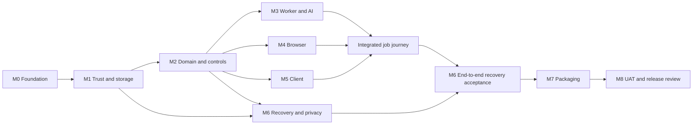

# LILA Claw — Implementation and delivery plan

Document ID: IMP-LILA-001  
Version: 1.0  
Status: Proposed execution plan — implementation not started  
Date: 7 September 2026  
Owner: Product sponsor; implementation and verification roles assigned per work package

## Objective and controlling documents

Build the approved Phase 1 product through the M0–M8 sequence, producing evidence against requirements at every increment. This plan operationalizes the project's agreed delivery process; it does not claim certification to an external standard or replace any specification.

| Baseline | Version / document | Used for |
|---|---|---|
| BRD | [v1.1](BRD-linkedin-intelligent-suite.md) | Business scope, outcomes, all 25 BR IDs and product phases |
| Solution design / SDD | [SD v0.31](solution-design.md) | Selected approach, 27 ADRs, feasibility disposition and scope boundaries; SDD refers to this existing SD document |
| FRD | [v0.3](FRD-LILA-Claw.md) and [FD package v0.1](FRD-functional-decisions-review.md) | Required behavior, rules, defaults, exceptions and measurable acceptance |
| HLD | [v0.1](HLD-LILA-Claw.md) | Components, trust boundaries, interface ownership and deployment architecture |
| LLD | [v0.2](LLD-LILA-Claw.md) | Implementation contracts, schemas, algorithms, dependencies, detailed tests and M0–M8 build order |
| Delivery process | [v1.0](delivery-process.md) | Document/build/UAT/release gates and change control |

All five specification stages are approved; see approval-records. The LLD package is preserved in [its approval record](approval-records/LLD-v0.2-approval.md). Implement directly from LLD while verifying behavior against FRD and business outcomes against BRD. If documents conflict, raise the conflict and resolve it through impact review; a lower-level document or code change cannot silently remove a higher-level requirement. Do not reopen approved decisions merely to begin coding.

## Scope and phase boundaries

Phase 1 includes the full supported local job-search/application journey; admin and lightweight client modes; compact Chrome extension; verified facts/resumes; authority/duplicate controls; history/analytics; privacy/audit/encryption; recovery; installer/updates; and qualification. Every Phase 1 requirement remains a release obligation even if first demos expose fewer screens.

Product phases remain: P2 Telegram; P3 scheduling; P4 additional channels and advanced recurring workflows. Networking/content/company/withdrawal modules retain their staged scope and required addenda; no date or reassignment is invented. This plan gives detailed execution for P1 and dependency/entry rules for later phases.

M0–M8 are engineering increments inside P1, not new product phase numbers. Local backup housekeeping remains P1 and does not implement P3 user scheduling.

## Working method

Use small, traceable vertical increments inside dependency-ordered milestones. Each work item has source IDs, deliverables, tests, dependencies, status and evidence. Unit/contract tests accompany implementation; system/security/recovery tests integrate progressively, with consolidated UAT at M8. Do not defer all testing until development ends.

Roles: implementation owner writes code and evidence; verification reviewer checks contracts, failures and regression coverage; sponsor owns requirements/UAT/release disposition. These are responsibilities, not assumed named staff or authorization to spawn agents. Default execution is one implementation stream; independent work may overlap only within the listed dependencies and explicit working arrangements.

Statuses: Planned → Ready → In progress → In review → Verified → Accepted, with Blocked carrying a specific dependency/decision. A file's existence is not completion. Accepted milestone requires verified exit evidence; sponsor approval is needed for changed requirements and UAT/release gates, not routine reversible internal coding steps already authorized.

## Phase 1 work breakdown

| Milestone | Work packages | Deliverables | Baseline references | Exit gate |
|---|---|---|---|---|
| M0 Foundation | W00.1 baseline/repository; W00.2 dependency locks/licenses; W00.3 contracts; W00.4 fixture harness | Isolated source layout, source-control baseline if needed, lockfiles/hashes, generated models, test command, evidence registry | HLD modules; LLD-06/07/08 | Reproducible Windows x64 imports; DDL/schema/OpenAPI checks; provider/browser doubles; license inventory |
| M1 Trust/storage | W01.1 supervisor; W01.2 TLS/bootstrap; W01.3 pairing/sessions; W01.4 encrypted stores | Launch/health/quit, trusted local channels, scoped sessions, SQLCipher migrations/DPAPI and staging primitives | FR-003/023/029; LLD-01/02/06/07 | Auth negative tests, encrypted canaries, crash-loop/quit behavior, migration failure behavior |
| M2 Domain/control | W02.1 task state; W02.2 facts/artifacts; W02.3 policies/approval; W02.4 identity/ledger/events | Complete durable domain services and API using doubles | FR-004–013/018/028; FD-001–003; LLD-02/03/07 | Correct pause/stop/restart, version edits, duplicate guards, durable command receipts and authority fences |
| M3 Worker/AI | W03.1 saver/graph; W03.2 provider/budget; W03.3 grounded drafting | Async worker integration, deterministic re-entry, selected provider adapter, usage accounting and factual validation | FR-010/013/022; FD-003/005; LLD-03/06/08 | Checkpoint conformance and replay; cost tests; approved factual evaluation distribution |
| M4 Browser | W04.1 extension/protocol; W04.2 discovery/forms; W04.3 uploads/outcomes; W04.4 authorized qualification | Scoped CDP toolset, versioned adapter catalog, handoff and outcome evidence | FR-002/006/014–017; FD-004; LLD-04/06/07 | All field families and negative fixtures; no cross-tab/account execution; live variants qualified before enabling them |
| M5 Full UX | W05.1 setup/tasks; W05.2 reviews/facts/docs; W05.3 analytics/admin; W05.4 accessibility | Both client modes, full screens, extension controls, pending-state honesty, reporting and settings | FR-001/002/020/021; FD-007; LLD-04 | UI mode parity, keyboard/zoom/theme, timezone/correction coverage and end-to-end user journey |
| M6 Privacy/recovery | W06.1 snapshots/portable export; W06.2 restore/rekey; W06.3 audit/retention/deletion | Consistent recovery, independent-profile restore, traceable cleanup and coverage indicators | FR-019/023–028; FD-006; LLD-02/06/07 | Corruption/key/disk/retention tests, 1 GB restore target, no restored execution authority |
| M7 Distribution | W07.1 onedir/installer; W07.2 signatures/updater; W07.3 clean-machine qualification | Installable build, optional login start, version/store activation and recovery, uninstall choices | FR-029; FD-008; LLD-05/06 | Signed/test-feed tamper tests, compatible upgrades, interrupted migration recovery and clean-machine evidence |
| M8 Acceptance | W08.1 regression/performance; W08.2 operational docs/UAT; W08.3 release disposition | Complete evidence pack, supported matrix/catalog, known limitations, recovery runbook and UAT record | All Phase 1 FR/BR and LLD tests | Required criteria passed or formally amended; sponsor UAT and explicit release decision |

## Dependency sequence and integration points

M4 starts against deterministic doubles after M2; narrative end-to-end completion needs M3. M5 starts after M2 with mocked contracts and completes against M3/M4. Encryption/backup primitives start in M1, but recovery acceptance needs actual action ledger and workflow state. Package skeleton can be exercised earlier; M7 acceptance waits for full integrated behavior.

Default serial work order is M0, M1, M2, M3, M4, M5, M6, M7, M8, with small early UI/packaging smoke checks where they de-risk interfaces. Do not imply that this graph allocates parallel teams or promises a completion date.

## First execution batch — M0

1. Verify approved snapshots, local working tree and existing entry points. Determine whether Git is present and whether the workspace is already a repository; preserve existing files/uncommitted work. If no repository exists, initialize local version control during authorized build setup and record the baseline; no remote publication implied.
2. Create the LLD source structure alongside the legacy program. Add configuration boundaries and a fake provider/browser adapter; no live account or API key needed.
3. Resolve/hash-lock the selected Python/Node build dependencies on supported Windows x64, verify licenses and the SQLCipher wheel identity, and record incompatibilities without silent substitution.
4. Generate Pydantic/TypeScript models from the shared contracts. Validate the complete JSON Schema with a real validator and OpenAPI contract tooling; the documentation-stage metaschema check was explicitly skipped and must not be treated as passed.
5. Promote approved design SQL into versioned migration code, with tests for syntax/FKs/unique guards/immutable rows and forbidden state/account combinations.
6. Establish repeatable unit/contract test commands and fixtures, evidence format and a minimal local CI-equivalent script; use a real CI host only if one is configured.
7. Demonstrate a command round trip and persisted receipt with doubles. Publish M0 evidence/status, resolve defects, then begin M1.

This batch is the next recommended implementation action after plan acceptance/start instruction. Preparing this plan does not start these tasks.

## Test and acceptance strategy

Use the exact test IDs and distributions in LLD-08. Each implementation PR/change set references BR→FR/FD→HLD component→LLD section→test IDs. If source control is unavailable, preserve equivalent reviewed change sets; never fabricate commits/CI runs.

| Test level | When | What it establishes |
|---|---|---|
| Static/schema/contract | M0 onward | Types, serialization, references and migration consistency; not runtime security |
| Unit/property cases | Each domain change | Policies, holds, identity, versions, counters, canonicalization and validation logic |
| Component/integration | M1 onward | Real process/store/protocol boundaries and failure responses |
| Browser/provider qualification | M3/M4 after fixtures | Actual selected provider and supported adapter behavior with separately authorized inputs/actions |
| Recovery/security/privacy | M1 primitives, M6 integrated | Fencing, trust, corrupted/old restore, retention, deletion and secret exclusion |
| System/performance/install | M7/M8 | Full supported Windows/Chrome build, timing targets and update behavior |
| UAT | M8 | Sponsor confirms complete business journey against approved requirements |

Carry forward FRD metrics unchanged: p95 command/status at most 2s, pending/unavailable shown after 5s without acknowledgment, warm start within 15s in 95% of 20 baseline runs, recovery assessment within 60s after dependencies, at most 24h between backups while continuously available, and 1 GB restore within 10 minutes under its stated exclusions. The 100-case factual set must have zero unsupported factual dispatch; interruption/authority cases must have zero unauthorized or duplicate outward dispatch. None is currently claimed passed.

Do not retry submitted external actions to make a test green. Record uncertain outcomes, reconcile, and retain evidence. Critical authority/duplicate/credential-exposure/destructive-recovery defects block release; any acceptance-target change requires recorded approval.

## Readiness inputs and when they are needed

| Input | Needed by | Without it |
|---|---|---|
| Windows x64 development toolchain and package access | M0 | Resolve local setup; do not claim build completion |
| Isolated test profile/VM for TLS, DPAPI and install tests | M1/M7 | Use component tests; real host trust/install qualification remains pending |
| Provider key, configured price/model and authorized evaluation data | M3 actual-provider qualification | Continue fake-provider contract tests; no account/service purchase assumed |
| Chrome test profile and authorized LinkedIn account/actions | M4 live qualification | Continue local synthetic fixtures; no live submission or contact messaging |
| Backup destination and separate recovery-key custody | M6 live-user setup | Test using isolated directories and synthetic keys |
| Publisher signing credentials, feed URL and production extension ID | M7 production release packaging | Use clearly labeled development/test artifacts; stable build must reject placeholders |
| Sponsor UAT availability | M8 | Evidence package can be prepared; acceptance/release cannot be invented |

Request inputs only when the dependent work is approaching; independent implementation continues using explicit doubles. Never ask the user to paste credentials into documentation. Certificate installation and browser activity use the product's explicit setup/action flow in an authorized test environment.

## Risks, controls and escalation

| Risk | Detect early | Response |
|---|---|---|
| Dependency/Windows incompatibility | M0 lock/import and M1 encrypted-store smoke | Resolve compatible patches within design; architecture/library change goes through impact review |
| Local trust setup denied by policy | M1 isolated host test | Report unsupported setup; no disabled certificate validation |
| Checkpoint replay duplicates intent | M3 fault injection | Stop affected work; fix stable action identity/fencing before browser integration |
| LinkedIn layout/account differences | M4 variant fixtures and live qualification | Fail closed/manual handoff; document missing required coverage for release review |
| Unbounded/unknown provider cost | M3 reservation tests | Pause hard-budget calls; never treat unknown as free |
| Restore/audit/deletion inconsistency | M6 crash/corruption matrix | Preserve working store, reconcile, and correct design/code through reviewed change |
| Missing production trust inputs | M7 preflight | Development build only; no unsigned stable release |

A blocked task identifies its dependency and owner; it does not imply the entire milestone is blocked when other work is ready. When a design defect is found, write issue + affected baseline IDs + proposed change + tests. Obtain required baseline-change approval before implementing a conflicting behavior. Accuracy takes precedence over mechanically copying a defective specification.

## Change, review and evidence management

Keep a work-item register and a requirements/test matrix. Each item records status, dependency IDs, source references, artifact paths, test result references, reviewer and unresolved risks. Suggested evidence root: docs/implementation-evidence/M{n}/ with build metadata, sanitized test reports and milestone summary; create it when implementation begins.

The initial [work-item register](implementation-work-items.json) contains 32 planned work packages with milestone dependencies and LLD references. All statuses start as Planned; assignee/reviewer fields are unassigned and evidence arrays empty. Update them only when work actually begins or evidence exists.

For each increment: select Ready item → implement/tests → self-review → independent review when assigned → resolve findings → update traceability → mark Verified with evidence → accept milestone when all exit conditions are met. Re-run affected regression, not every expensive test after every editorial change. Do not mark features Done because scaffolding exists or fixtures alone pass an integration obligation.

Milestone report contains delivered behavior, BR/FR coverage, passed/failed/not-run tests, limitations, unresolved defects, next Ready items and required inputs. No daily reporting automation is created by this plan.

## Estimation and scheduling

The dependency plan is the current schedule baseline. Calendar dates, staffing and effort are not yet established; no unsupported duration is promised. After M0 resolves the environment and M1 validates the highest-risk primitives, estimate remaining work from measured throughput and known defects. Reforecast after each milestone; include qualification/UAT and production-input lead time. Scope changes require explicit impact on delivery sequencing.

## Later phases

P2 entry: accepted P1 foundation plus approved Telegram-specific FRD/HLD/LLD addenda; implement owner identity, durable inbox/outbox, callbacks and the same command controls. P3 entry: approved scheduling addenda including DST/misfire/overlap; implement unique triggers and cancellation without new action authority. P4 entry: use-based prioritization and channel/recurrence addenda. Broader suite modules receive their own release assignments without replacing the approved phase order.

Do not delay P1 by drafting every future detail, and do not label future modules complete because their interfaces are reserved.

## Approval and immediate next step

This plan is submitted for execution review. Recommended start: M0 foundation only, then continue dependency-ordered milestones within authorized build scope, with visible evidence and the existing change/UAT/release gates. No new approval is requested for already approved BRD/FRD/SD/HLD/LLD. This turn records LLD approval and prepares the plan; it does not begin product implementation.
