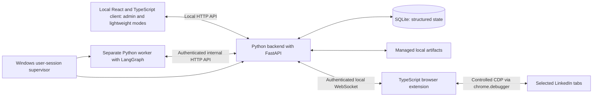

# LILA Claw — Solution Design

Document ID: SD-LILA-001  
Version: 0.31  
Status: Consolidated draft — submitted for final review, approval pending  
Date: 7 September 2026  
Source: approved BRD-LIS-001 v1.1

## Purpose and current position

This consolidated review draft defines the selected approach before FRD, HLD, and LLD. It incorporates 27 approved ADRs, the proposed end-to-end journey, scope boundaries, and an explicit disposition of remaining feasibility work. Final approval is requested for this package; no implementation feasibility tests are claimed.

The sponsor authorized progression to solution design by stating “let us go for next step” after review of BRD v1.0.1. The separate approval record preserves that context. Approval of an individual design decision does not approve all remaining choices.

## Decision register

| ID | Topic | Status | Record / next question |
|---|---|---|---|
| ADR-001 | Local web client, TypeScript interfaces, Python backend | Approved | [Decision record](design-decisions/ADR-001-local-client-and-language-boundaries.md) |
| ADR-002 | Backend-to-extension communication | Approved: Option B | [Authenticated local WebSocket](design-decisions/ADR-002-extension-transport.md) |
| ADR-003 | Backend framework | Approved: FastAPI | [Framework decision](design-decisions/ADR-003-backend-framework.md) |
| ADR-010 | Worker lifecycle and supervision | Approved: separate supervised worker | [Worker decision](design-decisions/ADR-010-worker-lifecycle.md); user-session supervision selected in ADR-021 |
| ADR-004 | Persistence and artifact storage | Approved: SQLite plus managed local files | [Storage decision](design-decisions/ADR-004-persistence-and-artifacts.md); protection/recovery approaches in ADR-025–027, implementation remains open |
| ADR-005 | AI provider strategy | Approved: provider-independent layer | [AI strategy](design-decisions/ADR-005-ai-provider-strategy.md); start with one validated hosted provider, local inference optional |
| ADR-016 | Factual validation | Approved: verified facts and controlled drafting | [Validation decision](design-decisions/ADR-016-factual-validation.md); detailed schemas and validation criteria remain open |
| ADR-017 | Browser execution strategy | Approved: extension-based CDP | [Browser execution](design-decisions/ADR-017-browser-execution.md); controlled tools and explicit outcome verification |
| ADR-018 | Workflow orchestration | Approved: persistent state machine with bounded AI reasoning | [Orchestration decision](design-decisions/ADR-018-workflow-orchestration.md); library selected in ADR-019 |
| ADR-019 | Orchestration library | Approved: LangGraph within worker | [Library decision](design-decisions/ADR-019-orchestration-library.md); checkpoint approach selected in ADR-020, implementation remains open |
| ADR-020 | Worker communication and checkpoints | Approved: authenticated internal HTTP API | [Internal communication](design-decisions/ADR-020-worker-communication.md); coordinator-managed storage and custom checkpoint adapter |
| ADR-021 | Process supervision and startup | Approved: user-session supervisor | [Startup decision](design-decisions/ADR-021-process-supervision.md); optional startup at login, detailed mechanism remains open |
| ADR-006 | Local authentication approach | Approved: local pairing and renewable, revocable sessions | [Authentication decision](design-decisions/ADR-006-local-authentication.md); exact protocol, storage, and lifetimes remain open |
| ADR-011 | Credential protection and recovery | Approved: Windows user-scoped DPAPI; re-entry/re-pairing | [Credential decision](design-decisions/ADR-011-credential-protection.md); restricted extension-local pairing storage |
| ADR-012 | Autonomous action permissions | Approved: scoped standing permissions | [Autonomy decision](design-decisions/ADR-012-autonomy-policy.md); defaults covered by ADR-013 and Telegram interaction by ADR-014 |
| ADR-013 | Autonomy configuration defaults | Approved: reusable time-bounded policies | [Policy defaults](design-decisions/ADR-013-autonomy-defaults.md); numeric limits and durations remain user-configurable |
| ADR-014 | Telegram identity and approvals | Approved: paired owner private bot chat | [Telegram interaction](design-decisions/ADR-014-telegram-identity-and-approvals.md); Phase 2 |
| ADR-015 | Telegram update delivery | Approved: long polling | [Delivery decision](design-decisions/ADR-015-telegram-update-delivery.md); Phase 2, outbound HTTPS |
| ADR-022 (DD-007) | Installation, updates, and supported machines | Approved: bundled Windows installer with controlled updates | [Installation decision](design-decisions/ADR-022-installation-and-updates.md); platform target in ADR-028, tooling and recovery details remain open |
| ADR-023 (DD-008) | Main client and extension user journeys | Approved: admin and lightweight modes plus compact extension | [Client experience](design-decisions/ADR-023-client-and-extension-experience.md); detailed flows and accessibility remain for FRD/UX design |
| ADR-024 (DD-009) | Reuse and staged delivery | Approved: new foundation with selective validated reuse | [Reuse decision](design-decisions/ADR-024-reuse-and-staged-delivery.md); component assessment, MacMedha evidence, and broader-module release assignments remain open |
| ADR-025 | Business-data backup and recovery | Approved: automatic local snapshots plus encrypted portable copies | [Recovery decision](design-decisions/ADR-025-backup-and-recovery.md); key-management implementation, retention, and restore details remain open |
| ADR-026 | Live-data and local-snapshot encryption | Approved: application encryption with automatic user-session unlock | [Encryption decision](design-decisions/ADR-026-live-data-encryption.md); libraries, key management, and recovery integration require validation |
| ADR-027 | Activity audit integrity, retention, and deletion | Approved: local tamper-evident journal with separate sensitive details | [Audit decision](design-decisions/ADR-027-audit-retention-and-deletion.md); integrity implementation, retention periods, and deletion/recovery details remain open |
| ADR-028 | Supported platform and validation baseline | Approved: Windows 11 Home/Pro x64 and Chrome Stable | [Platform decision](design-decisions/ADR-028-supported-platform-baseline.md); hardware targets and exact supported versions require qualification |
| ADR-029 | Withdrawal scope and priority | Approved: both workflows; invitation withdrawal first | [Withdrawal decision](design-decisions/ADR-029-withdrawal-scope.md); application withdrawal requires validated platform support, release assignments remain for FRD |
| ADR-030 | Phase 1 supported-form scope | Approved: supported applications plus job-search/filter forms | [Form-scope decision](design-decisions/ADR-030-phase-one-form-scope.md); exact catalog and variants require validation; external employer forms initially use handoff |

## Approved architecture outline

The backend serves the compiled client and API together. The extension handles browser interaction. The separate worker plans and advances tasks, requesting browser actions through the coordinator. The coordinator owns database writes and durable workflow state; the worker uses its internal API, including the checkpoint adapter selected in ADR-020. The supervisor manages process startup and bounded recovery. Database and managed artifacts are encrypted under ADR-026; portable recovery and audit integrity follow ADR-025 and ADR-027. This diagram defines responsibilities, not a completed interface or deployment specification.

## Delivery scope and interface responsibilities

Phase 1 delivers the local client, extension, reliable execution foundation, and complete supported job-search/application journey, including the other Phase 1 requirements in the BRD. ADR-030 limits the initial additional-form catalog to job-search/filter forms; external employer applications receive a manual handoff. Catalog expansion requires validation and release review.

Admin and lightweight modes share one local web application. Admin exposes full application configuration, operational review, and recovery; lightweight mode supports daily instructions, progress, approvals, and results. The compact extension exposes browser status/access, review prompts, pause and stop, and links to task details. Full administration does not mean Windows administrator privileges. Themes, analytics, privacy controls, and version history remain required even where not shown in the journey below.

Telegram remains Phase 2, scheduling Phase 3, and additional channels/advanced recurring workflows Phase 4. Networking, content, and company modules remain committed staged scope; precise release assignments follow in FRD. Both withdrawal workflows remain in scope, invitation withdrawal first with networking, and application withdrawal subject to validated support. Withdrawal is not a dependency of the initial application journey.

## Proposed end-to-end journey — included in final review

| Step | User experience | Architectural owner and behavior |
|---|---|---|
| 1. Give instructions | Enter job criteria in either client mode | Coordinator persists task, criteria, and applicable policy; worker plans within those bounds |
| 2. Check readiness | See missing information or connection issues | Coordinator checks facts, resume readiness, pairing, account/tab scope, and budgets; extension reports browser availability |
| 3. Discover and shortlist | See matching jobs and relevance explanations | Worker applies criteria through coordinator-dispatched supported browser tools; coordinator prevents duplicate processing |
| 4. Prepare | Review resume and answers when needed | Deterministic factual filling and grounded worker drafting use versioned verified information; coordinator validates proposed action data |
| 5. Authorize | Approve where required | Coordinator checks current details against explicit approval or a valid scoped standing policy immediately before dispatch |
| 6. Execute | Track progress, pause or stop further work | Coordinator dispatches bounded extension actions and evaluates returned outcome evidence |
| 7. Record and continue | See results and analytics | Coordinator records outcome, evidence references, policy/document versions and progress; worker continues eligible work |

There is no mandatory review at every step when a valid standing policy covers the action. Missing facts, material changes, expired authority, and unsupported cases still require handling. AI reasoning cannot expand scope or declare an unverified submission successful.

| Interruption | Proposed behavior |
|---|---|
| Missing or contradictory facts | Pause the affected application and request clarification; unrelated eligible work may continue under the existing single execution-owner model |
| Unsupported form/external site | Preserve progress and request manual completion; do not mark submitted |
| Browser disconnect/process restart | Restore state, reconnect, and reconcile dispatched actions before resuming |
| Uncertain submission | Record uncertainty and block automatic resubmission until resolved |
| Expired permissions/exhausted budget | Pause affected actions and explain what needs attention |
| User pause/stop | Prevent further dispatch once acknowledged; already-submitted actions cannot be undone; detailed pause versus stop semantics belong in FRD |
| Closed client | Continue authorized background work while required services are available |
| Restored backup | Keep restored tasks paused for permission and outcome reconciliation under ADR-025 |

Distinguish user-reported manual completion from system-verified completion. Versioned records and correction events preserve that provenance. This journey is submitted for final approval; it has not been recorded as a separate approved ADR.

## Feasibility evidence and proposed risk disposition

Existing ADRs link official technical documentation and record option rationale. Local inspection identifies reusable candidates in the existing Flask/Selenium application; no new-architecture integration tests have been run. Documentation support establishes plausibility, not end-to-end feasibility or reliability.

The proposed disposition is to carry these explicit risks into FRD/HLD/LLD and require evidence before accepting the affected implementation or releasing it. Failure that requires changing an approved boundary returns for impact review and approval; no silent substitution or weaker protection is permitted. Approval of this document would accept this validation plan, not claim the tests have passed or authorize immediate development.

| Risk / evidence status | Required next-stage work and acceptance evidence | Failure disposition |
|---|---|---|
| Local pairing: approach selected, exact protocol unproven | HLD defines trusted bootstrap/mutual authentication, scopes and replay/revocation handling; implementation tests reject impostor servers and stale credentials | Block affected connection; revise protocol, or seek an ADR change if architecture must change |
| LangGraph checkpoint adapter: custom coordinator-mediated integration unproven | HLD/LLD define checkpoint contracts and dispatch ledger; interruption/replay tests show no duplicate outward dispatch | Retain uncertainty and pause; revisit adapter/library decision if required |
| Chrome execution: debugger approach documented, actual form catalog unvalidated | Specify forms in FRD; validate fields, uploads, transitions, disconnects, and confirmed/uncertain outcomes | Manual handoff for unsupported cases; no blanket browser-capability claim |
| Encrypted Windows package: library/build combination unselected | Validate database/document encryption, bundled runtime, journals/temp files, automatic unlock and clean-machine install | No plaintext fallback; reassess library/packaging with recorded impact |
| Backup/audit integration: design selected, key/retention mechanics unproven | Define portable recovery independent of original profile, deletion continuity, journal verification and migrations; test restoration and corruption | Reject invalid restore or pause dependent work; report limits of old detached copies |
| Hosted AI: no provider/model selected or evaluated | FRD sets factual/structured-output, latency, cost and data-handling criteria; HLD selects candidate; evaluate with synthetic or separately authorized data before real use | Constrain answers/request facts; re-evaluate provider under approved abstraction, no silent cross-provider fallback |
| Hardware/session availability: targets only | Qualify exact Windows/Chrome versions, 8 GB/16 GB test configurations, startup, sleep/logout and storage sizing | Publish measured support limits; revisit requirements if target cannot be met |
| Reuse and platform-dependent later scope | Assess local candidates and licenses before adoption; verify MacMedha only if available; validate later module actions before release commitments | Implement compatible alternatives within approved boundaries; MacMedha remains optional |

No numeric latency, retention, recovery-time, cost, or hardware-performance guarantee is approved by this draft. FRD must define measurable targets for review. Provider evaluation does not authorize purchases or sending personal information. Detailed testing follows the existing document/development gates; this package introduces no automatic prototype execution.

## Traceability and downstream deliverables

The [gap review](solution-design-gap-review.md) covers every BR-01 through BR-25 and lists remaining elaboration. Approved BRD wording is unchanged. The 27 ADRs remain the decision records; material deviations require impact review.

| Deliverable | Work carried forward |
|---|---|
| FRD | Detailed journeys/catalog, permission exceptions, pause/stop, manual completion, analytics, accessibility/themes, export/deletion, numeric limits and quality targets, release scope, acceptance criteria linked to BR IDs |
| HLD | Component interfaces/trust boundaries, provider selection, checkpoint integration, encryption/key/recovery architecture, audit/retention structure, installer/update design |
| LLD by module/release | Schemas, endpoints/messages, state transitions, library integration, retries, migrations, file lifecycle and detailed tests |
| Implementation/qualification | Evidence for the risks above, security/factual evaluation, supported-machine measurements, UAT and release approval |

FRD, HLD, and LLD are not completed by this document. Future-phase detail is elaborated before that phase and must not silently alter Phase 1 boundaries.

## Approved documentation sequence

The sponsor approved this sequence on 7 September 2026; see [delivery process](delivery-process.md). BRD v1.1 is approved; see its [approval record](approval-records/BRD-v1.1-approval.md). Solution design has resumed. ADR-001 remains approved.

| Stage | Main question | Deliverable and boundary |
|---|---|---|
| BRD | Why build it, for whom, and with what outcomes? | Scope, business requirements, constraints, success measures |
| Solution design and feasibility | Which approach should we choose, and why? | Options, tradeoffs, feasibility evidence, ADRs, conceptual architecture, unresolved risks |
| FRD | Exactly what must the product do? | Workflows, rules, permissions, exceptions, acceptance criteria, associated measurable quality requirements |
| HLD | How do the major parts satisfy those requirements? | Component responsibilities, interfaces, data flows, deployment, security and recovery architecture |
| LLD | How will each component be implemented? | Schemas, API/message definitions, state transitions, algorithms, module details, errors, migrations, test cases |
| Development and verification | Does the implementation meet the approved requirements? | Implementation, test evidence, UAT, and release review |

Feasibility starts during BRD preparation and continues through design. FRD and HLD are refined together: architecture constraints can reveal missing requirements, and detailed requirements can require revisiting an ADR. Record changes explicitly. Keep the solution design focused on option selection; use HLD for the resulting engineering structure to avoid duplicating documents.

Prepare and review LLD by module or release slice before implementing that slice. Future-phase LLD need not delay Phase 1. Preserve BRD to FRD to HLD/LLD to test traceability. Existing BRD development and release approval gates remain applicable.

## Final review and approval request

Review SD-LILA-001 v0.31 as a consolidated package: the selected architecture and scope, proposed end-to-end journey/interruption behavior, and explicit deferral of implementation feasibility evidence under the validation plan above. Approval authorizes progression to FRD preparation under the agreed process. It does not approve FRD/HLD/LLD, claim tested feasibility, authorize a deployment, or bypass development/release gates. Status remains pending until sponsor approval is recorded against this version. On approval, preserve this review version and record the approved baseline and approval evidence.

## Retained future scope

**Native Messaging can remain a future setup helper**, if installation experience justifies it. This is not part of the approved initial transport implementation; see ADR-002.

## Version history

- 0.1: Established the solution-design working document, recorded ADR-001, and proposed document boundaries and remaining decisions. No implementation changes.
- 0.2: Recorded the approved delivery sequence and BRD restructuring review.
- 0.3: Adopted approved BRD v1.1 and prepared ADR-002 options for sponsor discussion. Transport remains unapproved.
- 0.4: Recorded approval of Option B, updated architecture, and retained the Native Messaging future setup comment.
- 0.5: Recorded FastAPI approval in ADR-003; separated worker lifecycle into DD-010 for the next discussion.
- 0.6: Recorded separate supervised worker approval in ADR-010, updated component responsibilities, and advanced the next discussion to persistence.
- 0.7: Recorded SQLite and managed local file storage approval in ADR-004; updated architecture and advanced discussion to authentication and credential protection.
- 0.8: Recorded local authentication approval in ADR-006; separated credential protection (DD-011) and action authority/remote approvals (DD-012) from the approved approach.
- 0.9: Recorded credential protection and recovery approval in ADR-011; advanced the next discussion to action authority and approval policies.
- 0.10: Recorded scoped standing permissions in ADR-012; retained BRD approval defaults until explicitly configured and deferred numeric limits, expiry, and Telegram mechanics.
- 0.11: Recorded reusable time-bounded policy defaults in ADR-013; advanced next discussion to Telegram identity and approval mechanics.
- 0.12: Recorded paired-owner private Telegram chat and approval behavior in ADR-014; update delivery remains undecided.
- 0.13: Recorded long polling approval in ADR-015, including persistence/deduplication and the 24-hour Telegram retention limitation; next discussion is AI strategy.
- 0.14: Recorded provider-independent AI strategy in ADR-005; separated factual validation into DD-016 and retained specific provider/model selection as open.
- 0.15: Recorded verified facts and source-linked drafting in ADR-016; advanced next discussion to browser execution strategy.
- 0.16: Recorded extension-based CDP approval in ADR-017, updated the architecture diagram, and advanced discussion to workflow orchestration.
- 0.17: Recorded persistent workflow state machine with bounded AI reasoning in ADR-018; framework/library selection remains the next discussion.
- 0.18: Recorded LangGraph selection in ADR-019; updated worker labeling and advanced discussion to internal communication and checkpoint integration.
- 0.19: Recorded internal HTTP and coordinator-managed checkpoints in ADR-020; updated the diagram and advanced discussion to process supervision and startup.
- 0.20: Recorded user-session supervision and optional login startup in ADR-021; updated the diagram and advanced discussion to installation and updates.
- 0.21: Recorded bundled Windows installation and controlled updates in ADR-022, including separate extension distribution and compatibility checks; advanced discussion to client and extension user journeys.
- 0.22: Recorded admin and lightweight modes within one local client plus a compact extension interface in ADR-023; advanced discussion to reuse and staged delivery.
- 0.23: Recorded selective validated reuse and staged delivery in ADR-024 without changing BRD phases; advanced discussion to business-data protection, backup, and recovery.
- 0.24: Recorded automatic local snapshots and encrypted portable recovery copies in ADR-025; retained credential exclusion and advanced discussion to live-data and local-snapshot protection.
- 0.25: Recorded application encryption with automatic user-session unlock in ADR-026; retained library and recovery validation and advanced discussion to audit integrity, retention, and deletion.
- 0.26: Recorded local tamper-evident audit history with separate sensitive details in ADR-027, including retention/deletion and local verification boundaries; advanced discussion to the supported-machine and browser baseline.
- 0.27: Recorded the Windows 11 x64/Chrome Stable support target in ADR-028 with unverified hardware targets clearly labeled; advanced to solution-design consolidation and gap review.
- 0.28: Consolidated 25 approved ADRs, mapped all BR requirements in a gap review, corrected stale open-status summaries, and separated approval review items from downstream detail. No requirements or approvals changed.
- 0.29: Recorded BR-19 scope and priority approval in ADR-029; updated gap disposition and advanced to Phase 1 known-form scope. Approved BRD wording and phase sequence remain unchanged.
- 0.30: Recorded Phase 1 form scope in ADR-030, including unsupported-form handling and external-site handoff; advanced to the conceptual end-to-end job journey.
- 0.31: Prepared consolidated final-review draft with complete conceptual journey, interruption behavior, evidence limitations, proposed risk disposition, and downstream deliverables. Final approval remains pending; no new ADR approval or implementation results claimed.
